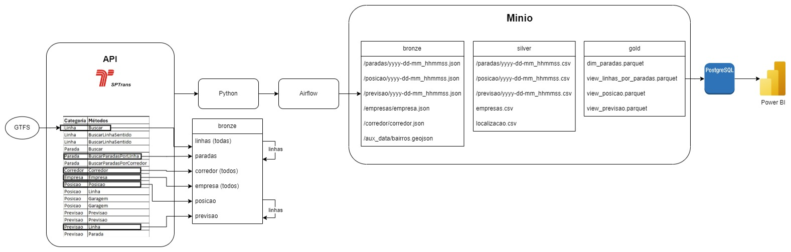

# Trabalho Final de Engenharia de Dados - FIA

Este repositório contém o trabalho final da pós-graduação em Engenharia de Dados pela FIA, que consiste na construção de uma aplicação de pipelines de dados utilizando o Apache Airflow para orquestrar a movimentação e transformação de dados entre diferentes camadas de um Data Lake.

## Estrutura do Repositório

A estrutura do repositório é organizada conforme os componentes e etapas do pipeline de dados:
```
├── dags/                                  # Pasta principal que contém as DAGs do Airflow
│   ├── dag_api_to_raw_to_trusted.py       # DAG para mover dados da camada RAW (bruta) para a camada TRUSTED (confiável)
│   ├── dag_raw_to_trusted_dims.py         # DAG para mover dados dimensionais da camada RAW para a camada TRUSTED
│   ├── dag_trusted_to_refined_parada.py   # DAG para refinar dados de parada (provavelmente pontos de parada de transporte)
│   ├── dag_trusted_to_refined_posicao.py  # DAG para refinar dados de posição (provavelmente a localização dos veículos)
│   ├── dag_trusted_to_refined_previsao.py # DAG para refinar dados de previsão (provavelmente horários de chegada ou partida)
│   ├── funcoes.py                         # Arquivo com funções auxiliares usadas em várias DAGs
│   ├── imports.py                         # Script para importar bibliotecas e configurações comuns
│   ├── utils.py                           # Arquivo com funções utilitárias para o processamento dos dados
│   └── desenvolvimento_dag.ipynb           # Notebook para testes de execução completa das DAGs, usado para validar a aplicação
├── docker/                                # Pasta com configurações do Docker, para facilitar o setup do ambiente
│   ├── Dockerfile                         # Arquivo de configuração para construir a imagem Docker
│   └── docker-compose.yml                 # Arquivo de composição do Docker para orquestrar múltiplos contêineres (Airflow, MinIO, etc.)
├── gtfs/                                  # Pasta para armazenar dados GTFS (General Transit Feed Specification)
├── minio/                                 # Configurações e dados usados pelo MinIO (sistema de armazenamento compatível com S3)
├── path_to_excel_directory/               # Diretório para armazenar arquivos Excel gerados ou utilizados no projeto
├── logs/                                  # Diretório onde são armazenados os logs de execução das DAGs
├── .env                                   # Arquivo de configuração com variáveis de ambiente (credenciais, configurações, etc.)
├── .gitignore                             # Arquivo que lista os arquivos/pastas a serem ignorados pelo Git (como arquivos sensíveis)
├── README.md                              # Documentação do projeto (esse arquivo)
├── requirements.txt                       # Lista de dependências Python para o projeto
├── poetry.lock                            # Arquivo de bloqueio de dependências gerado pelo Poetry para garantir versões específicas
├── pyproject.toml                         # Configuração do projeto e das dependências, usado pelo Poetry
└── catálogo api.xlsx                      # Catálogo de dados da API, mapeando informações sobre os dados que a API fornece
```

## Tecnologias Utilizadas

- **Apache Airflow**: Ferramenta de orquestração para gerenciamento de pipelines de dados.
- **Python**: Linguagem principal para desenvolvimento das DAGs e scripts auxiliares.
- **Docker**: Contêineres para configuração e execução do ambiente de desenvolvimento de forma isolada.
- **MinIO**: Armazenamento de objetos compatível com Amazon S3 para gerenciamento dos dados.
- **GTFS (General Transit Feed Specification)**: Padrão de dados utilizado para os dados de transporte.


## Configuração e Inicialização do Ambiente

Este guia descreve o processo para configurar e iniciar o ambiente de desenvolvimento usando Docker, incluindo as instruções para acessar o Airflow e configurar as conexões.

### Pré-requisitos

Certifique-se de ter o Docker e o Python 3.10 instalados na sua máquina.

### Inicializar o Ambiente

1. Instalar o requirements.tx
2. Para construir e iniciar os contêineres, utilize o seguinte comando no terminal:

```
docker-compose -f docker/docker-compose.yml up --build
```

### Parar e Remover os Contêineres do Ambiente
Para encerrar todos os contêineres e remover os recursos alocados, execute:
```
docker-compose -f docker/docker-compose.yml down
```

### Criar o Usuário para Fazer Login no Airflow

Após inicializar o serviço, crie um usuário admin para acessar a interface do Airflow:

1. Acesse o container do webserver:
   ```
   docker compose -f docker/docker-compose.yml exec webserver bash
   ```

2. No container, crie o usuário admin do Airflow:
```
airflow users create \\
    --username admin \\
    --firstname Firstname \\
    --lastname Lastname \\
    --role Admin \\
    --email admin@example.com \\
    --password admin
```

4. Criar secret key no Minio
    1. Credenciais do Minio:
        ```
        Usuário: admin
        Senha: minioadmin
        ```
    2. Entre em Access Keys no menu lateral e crie uma nova.
    3.  Acesse os arquivos .py nas dags e adicione as credenciais criadas na Access Keys

## Estrutura das DAGs

As DAGs são responsáveis por mover e transformar dados entre diferentes camadas de um Data Lake, seguindo a metodologia de arquitetura em camadas.

- **`dag_api_to_raw_to_trusted.py`**: Captura dados de uma API externa e armazena na camada BRONZE. Em seguida, move os dados processados para a camada SILVER.
- **`dag_raw_to_trusted_dims.py`**: Processa e move dados dimensionais da camada BRONZE para SILVER.
- **`dag_trusted_to_refined_parada.py`**: Refina dados de parada, transformando-os para a camada GOLD.
- **`dag_trusted_to_refined_posicao.py`**: Processa dados de posição para a camada GOLD.
- **`dag_trusted_to_refined_previsao.py`**: Refina dados de previsão, preparando-os para análises mais aprofundadas.

## Instruções para Execução das DAGs

1. Acesse a interface do Airflow e ative as DAGs desejadas para iniciar o pipeline de dados.
2. Acompanhe o progresso e a execução das tarefas em tempo real na interface do Airflow.
3. Verifique os logs gerados na pasta `logs/` para diagnósticos e acompanhamento do processamento dos dados.

## Estrutura de Dados

A estrutura e organização dos dados seguem as seguintes camadas:

- **Bronze**: Dados brutos coletados diretamente da fonte.
- **Silver**: Dados processados e limpos, confiáveis para uso.
- **Gold**: Dados transformados e otimizados para análise e consumo final.

## Arquitetura do Projeto



---


